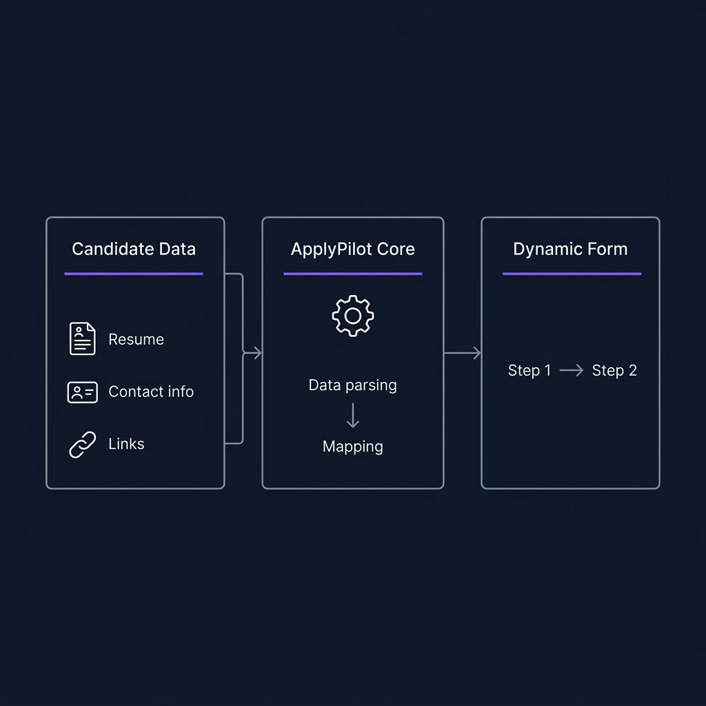
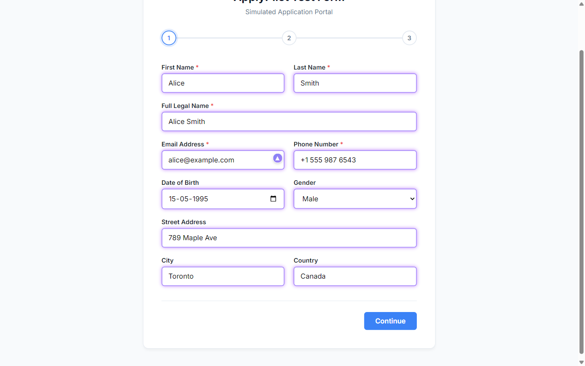
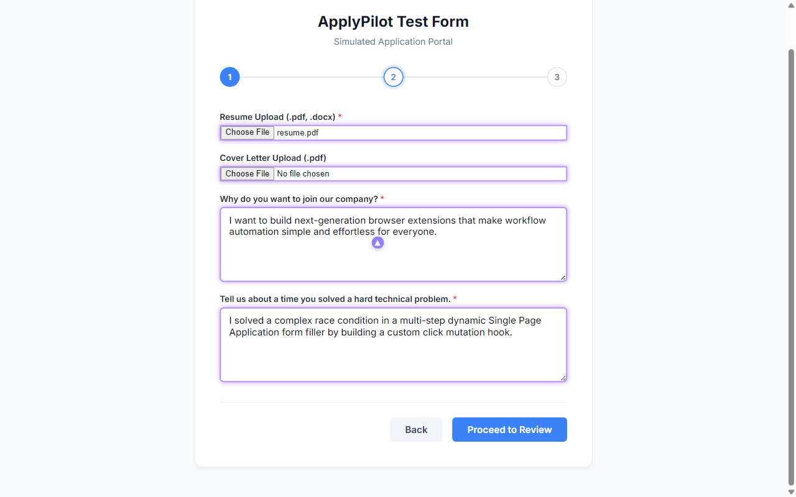

# ApplyPilot 🚀

ApplyPilot is an intelligent form filler and job application assistant Chrome/Edge extension powered by Google Gemini AI. It automates filling out long job applications, handles file uploads (like resumes/cover letters), and uses AI to generate concise, professional answers to custom application essay questions.



---

## ✨ Features

*   **Intelligent Field Mapping:** Locally identifies form inputs using semantic heuristics (regex matches for common patterns).
*   **Dynamic SPA Form Support:** Automatically detects panel transitions and form validation updates in Single-Page Applications (SPAs) and dynamic forms, re-scanning and prefilling inputs step-by-step.
*   **Base64 File Injection:** Automatically handles file upload inputs (like resumes and cover letters) by converting base64 data to File objects in the DOM.
*   **AI Resume Parser:** Parses raw resume text using Gemini API into structured JSON to instantly populate the user profile.
*   **AI Custom Q&A Generator:** Automatically writes professional responses to application essay questions tailored to the candidate's background using Google Gemini.
*   **Local Developer Preview:** Works out-of-the-box when opening `options.html` directly from the local file system (`file://` protocol) with mocked storage support.

---

## 📂 Project Structure

```
automatic-form-fill/
├── manifest.json       # Extension manifest (MV3)
├── background.js       # Background service worker (state, AI calls, orchestration)
├── content.js          # Webpage DOM context script (scans inputs, performs injection)
├── content.css         # Styling for inline trigger & profile dropdown
├── field_rules.js      # Heuristics rules matching labels to profile fields
├── ai_helper.js        # Gemini API integration wrapper
├── popup.html/js/css   # Extension popup interface
├── options.html/js/css # Extension configuration dashboard (profiles & API keys)
├── mock_form.html      # Simulated multi-step job application portal for testing
├── server.js           # Lightweight test server for mock_form.html
└── test_extension.js   # Playwright integration test suite
```

---

## 🏃 Getting Started

### 1. Load the Extension in your Browser (Edge / Chrome)
1. Open your browser and navigate to the extensions manager:
   * **Chrome:** `chrome://extensions`
   * **Edge:** `edge://extensions`
2. Enable **Developer Mode** (usually a toggle in the top-right or sidebar).
3. Click **Load unpacked** (developer mode button) and select the `automatic-form-fill` project root directory.

### 2. Configure your Profile & Gemini Key
1. Open the extension popup from your browser toolbar and click the **Settings (gear) icon** at the top right.
2. In the configuration dashboard:
   * Paste your Gemini API Key in the **Settings** tab (Get a key from [Google AI Studio](https://aistudio.google.com/)).
   * Add your personal details, professional links, resume text, and pre-written custom Q&As in the **Profiles** tab.
3. Click **Save Profile** at the bottom of the page.

### 3. Test on the Mock Form
1. Run the test server:
   ```bash
   node server.js
   ```
2. Open **[http://localhost:8080/mock_form.html](http://localhost:8080/mock_form.html)**.
3. Click the purple inline trigger icon in the email input (or open the extension popup and click **Start Automation**).
4. Select your profile, and watch the extension autofill the fields and automatically proceed through the steps!

---

## 📸 Demonstration

### Step 1: Personal Details auto-filled (automatically transitions after filling)


### Step 2: Files & Custom AI essay answers auto-filled dynamically


---

## 🧪 Running Automated Integration Tests

To run the Playwright integration test suite:
1. Ensure dependencies are installed:
   ```bash
   npm install
   ```
2. Run the test command:
   ```bash
   node test_extension.js
   ```

---

## 🔒 Security & Privacy

* **Local Verification:** Form filling runs entirely client-side. The extension will never automatically submit a form; the user must manually review and hit the final submit button.
* **Sensitive Data:** All personal profiles and API keys are stored securely using browser local storage (`chrome.storage.local`) and never leave your machine except when calling the official Gemini API endpoints.
